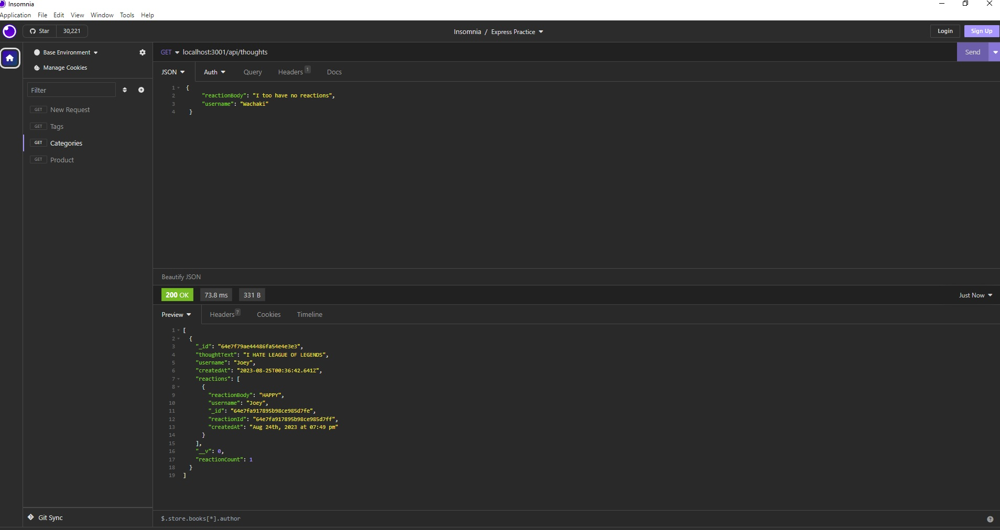

# social-network-api

## Description

This program uses MongoDB to make a social network web application where users can share their thoughts, react to friends’ thoughts, and create a friend list!

Express.js is used for routing the MongoDB database and the Mongoose ODM.

The best way to use this program is to use Insomnia! In Insomnia, you are able to see the routes, post, and delete users, thoughts, and reactions!

Here are the routes you can use for this program!

NOTE: FOR ANYTHING IN (), REPLACE THE () AS WELL AS MESSAGE INSIDE!

GET: localhost:3001/api/users - To view all users
GET: localhost:3001/api/thoughts - To view all thoughts
GET: localhost:3001/api/thoughts/(THOUGHTSID) - To view the thought related to the ID

NOTE: FOR POSTS, REPLACE THE () AS WELL AS MESSAGE INSIDE

POST: localhost:3001/api/users - To create a user

 {  
      "username": "(PUT USERNAME HERE)",
      "email": "(PUT EMAIL HERE)"
  }

POST: localhost:3001/api/thoughts - To post thoughts

 {  
      "thoughtText": "(PUT THOUGHT TEXT HERE)",
      "username": "(PUT USERNAME ASSOCIATED WITH THOUGHT HERE.)"
  }

POST: localhost:3001/api/thoughts/(THOUGHTSID)/reactions - To post a reaction to the thought

 {  
      "reactionBody": "(PUT REACTION HERE)",
      "username": "(PUT USERNAME WITH THE REACTION HERE)"
  }

POST: localhost:3001/users/(USERID)/friends/(FRIENDID TO ADD) - To add a friend to a user

DELETE: localhost:3001/api/users/(USERID) - Deletes a user
DELETE: localhost:3001/api/thoughts/(THOUGHTID) - Deletes a thought
DELETE: localhost:3001/api/thoughts/(THOUGHTSID)/reactions/(REACTIONID) - Deletes a reaction
DELETE: localhost:3001/users/(USERID)/friends/(FRIENDID TO ADD) - To delete a friend to a user

## Installation

You can view this video to see how it works here!

(VIDEO HERE)

You can visit the repo on my github here!

https://github.com/Rockojoe2/socialnetworkapi

## Credits
UTA class folder

Worked with classmates May Pham (https://github.com/mayphamx) and Mica Villanueva(https://github.com/micavilla) 

## License

MIT License

---